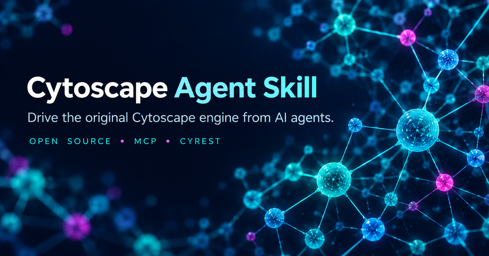

<div align="center">
  

  # Cytoscape Agent Skill

  **Drive the original Cytoscape Desktop engine from AI agents.** Keep network analysis and visualization inside Cytoscape; let the agent select documented commands.

  [](LICENSE)
  [](https://www.python.org/)
  [](https://cytoscape.org/)
  [](#connect-an-agent)
</div>

> **What this is:** a portable skill package and zero-dependency Python CLI that drives Cytoscape through CyREST and Commands API. It does not reimplement Cytoscape algorithms. Results are produced by the Cytoscape engine you run.

## Languages

[简体中文](README.zh-CN.md) · [Español](README.es.md) · [Français](README.fr.md) · [Deutsch](README.de.md) · [日本語](README.ja.md) · [한국어](README.ko.md) · [Português](README.pt-BR.md) · [Русский](README.ru.md) · [العربية](README.ar.md) · [हिन्दी](README.hi.md)

## What it can do

- Import and export networks, tables, sessions, and visual assets through Cytoscape's APIs.
- Discover the actual command surface before execution; never guess command names or arguments.
- Apply Cytoscape layouts, styles, mappings, and analysis commands using the original engine.
- Connect MCP-capable clients over Streamable HTTP, or use the included stdio bridge.
- Generate host-specific MCP configuration for nine client families.
- Run JSON workflows and write provenance manifests with engine version, input SHA-256 hashes, requests, and result fingerprints.
- Check installation and runtime readiness with actionable diagnostics.

## Quick start

Requirements: Python 3.8+, Cytoscape Desktop 3.10+ and Java 17+. This package has no third-party Python dependencies. On Linux without a display, install Xvfb and use `--headless`.

```bash
git clone https://github.com/cndoin/cytoscape-agent-skill.git
cd cytoscape-agent-skill/cytoscape-agent-skill
python scripts/cyctl.py doctor
python scripts/cyctl.py discover
```

If Cytoscape is installed, start it with `python scripts/cyctl.py start --engine system`. To let the tool install the pinned engine/JRE, read `docs/03-跨Agent接入指南.md` first, then use `provision`; installer execution changes your machine. Check `doctor` again, then:

```bash
python scripts/cyctl.py start
python scripts/cyctl.py wait
python scripts/cyctl.py status
python scripts/cyctl.py commands network
```

For a guided task, try `python scripts/cyctl.py run workflows/demo.workflow.json --out runs/demo.manifest.json`.

## Connect an agent

With Cytoscape and the official Cytoscape MCP Server app running:

```bash
python scripts/cyctl.py mcp                       # Show configurations for supported hosts
python scripts/cyctl.py mcp --host cursor          # Show one host
python scripts/cyctl.py mcp --write-config --only-dedicated --project . --scope project
```

Configuration writing is opt-in. Mixed host configuration files are intentionally refused; review and merge the printed snippet yourself. For stdio-only clients such as Claude Desktop, run `python scripts/cyctl.py bridge --port 1234` and use the generated bridge configuration. Host-specific details: [`docs/03-跨Agent接入指南.md`](cytoscape-agent-skill/docs/03-%E8%B7%A8Agent%E6%8E%A5%E5%85%A5%E6%8C%87%E5%8D%97.md).

## Safety and reproducibility

- The tool queries Cytoscape for its command surface. It does not use NetworkX, igraph, or custom code as a substitute for Cytoscape calculations.
- Potentially destructive commands are guarded. A failed workflow step stops execution.
- Downloads are checked against the version lock when an official digest exists; unverifiable artifacts fail closed unless explicitly overridden.
- Layout coordinates may be stochastic. A workflow manifest supports traceability, but does not make randomized layouts deterministic.
- When using an existing/system engine, report its actual version.
- Export PNG/PDF/SVG/CX with `rest ... --out FILE` so bytes are preserved.

## Validation

The repository includes unit/safety tests, upstream audit evidence, and reproducible packaging tools. Run locally:

```bash
python -m unittest discover -s tests -v
python tools/package.py --verify
```

Real-engine checks depend on a local Cytoscape installation and its installed apps. Review [`docs/07`](cytoscape-agent-skill/docs/07-%E9%AA%8C%E8%AF%81%E4%B8%8E%E7%A8%B3%E5%AE%9A%E6%80%A7%E6%8A%A5%E5%91%8A-2026-10-01.md) and [`docs/08`](cytoscape-agent-skill/docs/08-%E4%B8%8A%E6%B8%B8%E5%AF%B9%E9%BD%90%E5%AE%A1%E8%AE%A1%E6%8A%A5%E5%91%8A-2026-10-02.md) for dated evidence; numbers in reports describe that test snapshot, not a permanent guarantee.

## AI-assisted installation

You can ask a coding agent to install this skill. Start it in a checkout or paste this request:

> Read `cytoscape-agent-skill/AGENTS.md` and `SKILL.md`. Run `python scripts/cyctl.py doctor` and `discover`, then explain the exact missing prerequisites and proposed changes. Do not install software, download the Cytoscape engine, or edit global agent configuration until I approve those specific changes. After approval, follow the documented setup, verify with `doctor`, and configure only the requested agent using `cyctl mcp`.

For agent-specific instructions and one-command setup, see [`INSTALL.md`](INSTALL.md). This project does not silently install software or modify global agent settings.

## Project map

The distributable skill is in [`cytoscape-agent-skill/`](cytoscape-agent-skill/). Begin with [`SKILL.md`](cytoscape-agent-skill/SKILL.md) for supported agents or [`AGENTS.md`](cytoscape-agent-skill/AGENTS.md) for the operational guardrails. Detailed architecture, support matrix, evidence, and audit reports are in `cytoscape-agent-skill/docs/`.

## License and attribution

Skill code and documentation are distributed under LGPL-2.1; see [`LICENSE`](LICENSE). Cytoscape Desktop and its apps are separate upstream software and are not bundled in this repository. Names and marks belong to their respective owners. The cover graphic was generated for this project.

## Contributing

Bug reports and pull requests are welcome. Include your OS, Python version, Cytoscape version, exact command, exit code, and the JSON error envelope; remove private network data first. See [CONTRIBUTING.md](CONTRIBUTING.md).
